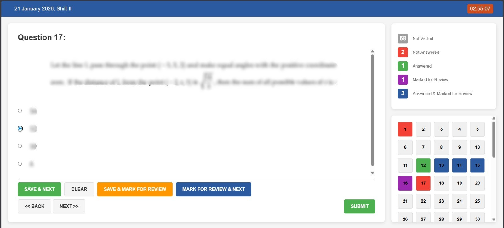

# JEE Mains CBT Practice Interface

A **recreation of the JEE Main Computer Based Test interface** for students, parents and educators. Built using Django.



(Screenshot question content blurred. Interface recreated for practice purposes only. [View more screenshots](screenshots/).)
This project allows users to **create and attempt mock JEE Main tests** using question papers extracted from official response sheet pages.

The goal of the project is to replicate the **look and behaviour of the real exam interface** so students can practice in an environment similar to the actual test.

---

# ⚠️ Disclaimer

This project is **NOT affiliated with or endorsed by** the National Testing Agency.

Important notes:

* This is **not the official exam interface**
* It is **only a recreation for educational/practice purposes**
* The repository **does not include any official JEE Main response sheets**
* The repository **does not distribute answer keys or exam questions**

Users must **obtain response sheet links themselves** if they wish to import a test.

Official information about JEE Main can be found on the NTA website:

[https://jeemain.nta.nic.in/](https://jeemain.nta.nic.in/)

---

# Features

* Recreated **JEE Main CBT exam interface**
* Multiple-User Support
* User login (`/auth/login/`) and registration (`/auth/register/`)
* Practice tests with:

  * question navigation
  * marking for review
  * section switching
* Detailed **attempt analysis**
* Custom **test import system** using official response sheet pages
* Built-in **management panel** for managing tests and attempts

---

# Downloading the Project

Clone the repository:

```bash
git clone <repository-url>
cd <repository-folder>
```

Or download the ZIP from GitHub and extract it.

---

# Setup

### Linux / macOS

Run:

```bash
./setup.sh
```

### Windows

Run:

```
setup.bat
```

These scripts will:

* install Python dependencies
* create database migrations
* apply migrations
* create a Django superuser (a user with access to the admin panel)

After setup, start the development server:

```bash
python manage.py runserver
```

Open:

```
http://127.0.0.1:8000
```
Users login at `http://127.0.0.1:8000/auth/login/` and a student may register at `http://127.0.0.1:8000/auth/register/`.

---

# Importing a Test

Tests are generated from **JEE Main response sheet pages**.

The repository does **not include any response sheets**.

You must find a response sheet URL yourself.

---

## Step 1 — Run the importer

Run the management command:

```bash
python manage.py import_jee_test
```

You will be prompted to enter:

* the response sheet URL (https://cdn3.digialm.com/....)
* the answer key

---

## Step 2 — Enter the Answer Key

Answers must be entered in the following format:

```
question_id answer
```

Example:

```
8606541193 8606544067
8606541194 8606544069
8606541195 8606544073
8606541196 20
8606541197 13
8606541198 70
```

Explanation:

| Part          | Meaning                               |
| ------------- | ------------------------------------- |
| first number  | question ID                           |
| second number | correct option ID OR numerical answer |

---

### MCQ Answers

For multiple choice questions, the answer is the **option ID**.

Example:

```
8606541193 8606544067
```

---

### Numerical Answers

For numerical questions, simply enter the number.

Example:

```
8606541196 20
```

---

### Multiple Correct Answers (MMCQ)

Sometimes the NTA **corrects a question and allows multiple answers**.

In that case, separate answers with commas:

```
8606541193 8606544067,8606544069
```

---

### Dropped Questions

If a question is dropped by the NTA, enter:

```
Drop
```

Example:

```
8606541198 Drop
```

---

# Management Panels

The project includes **two admin interfaces**.

### Custom Management Panel

```
/manage/
```

Features:

* view tests
* delete tests (**Also deletes test attempts!**)
* view user attempts
* test analyses

---

### Default Django Admin

```
/admin/
```

Note: the CSS may appear broken because static files are not fully configured for production.

---
# Building Custom Tests

Building custom tests requires an understanding of Django models and the data model structure in this project.

## Data Model Structure

The core structure is defined in `test_app/models.py`.

## Test Model

Represents a single exam session.

Fields:

| Field | Purpose                         |
| ----- | ------------------------------- |
| name  | name of the test                |
| date  | test date                       |
| shift | exam shift (Shift 1 is `False` & Shift 2 is `True`) |

Source:

```python
class Test(models.Model):
    name = models.CharField(max_length=100)
    date = models.DateField()
    shift = models.BooleanField()
```

---

## Question Model

Represents an individual question in a test.

Fields:

| Field           | Purpose                                  |
| --------------- | ---------------------------------------- |
| test            | associated test                          |
| subject         | Physics / Chemistry / Mathematics        |
| section         | Section 1 (MCQ) (`False`) or Section 2 (Numerical) (`True`) |
| question        | image of the question                    |
| question_id     | original question identifier             |
| question_number | order in the test                        |
| option_1–4      | images of answer options                 |
| correct         | correct answers                          |

Source:

```python
class Question(models.Model):
    test = models.ForeignKey(Test, on_delete=models.CASCADE)
    subject = models.CharField(max_length=50)
    section = models.BooleanField()
    question = models.ImageField(upload_to='static/questions/')
    question_id = models.CharField(max_length=20)
    question_number = models.IntegerField()
    option_1 = models.ImageField(upload_to='static/options/')
    option_2 = models.ImageField(upload_to='static/options/')
    option_3 = models.ImageField(upload_to='static/options/')
    option_4 = models.ImageField(upload_to='static/options/')
    correct = models.JSONField(default=list, blank=True)
```

---

# Credits

Created by **[vismodo](https://github.com/vismodo)**.

This project is a **recreation of the JEE Main CBT interface** for practice and experimentation.

It is **not the official NTA interface**.

---
